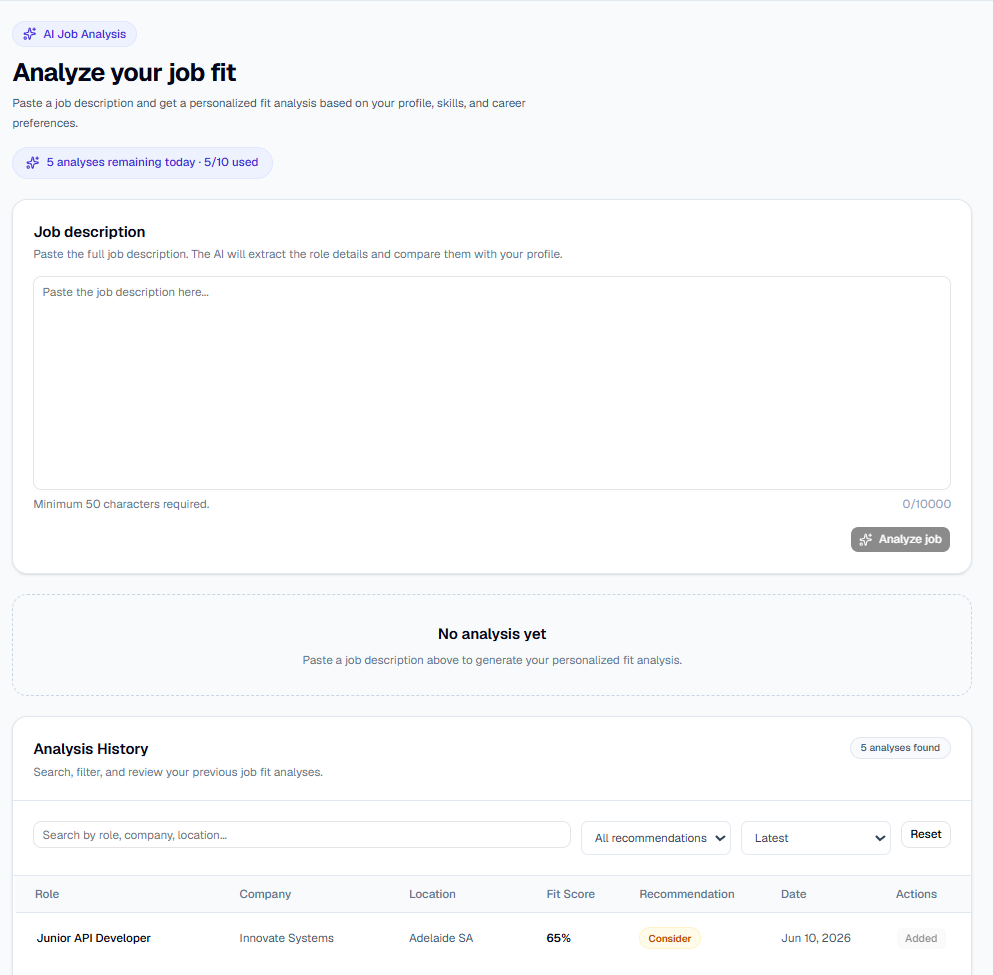
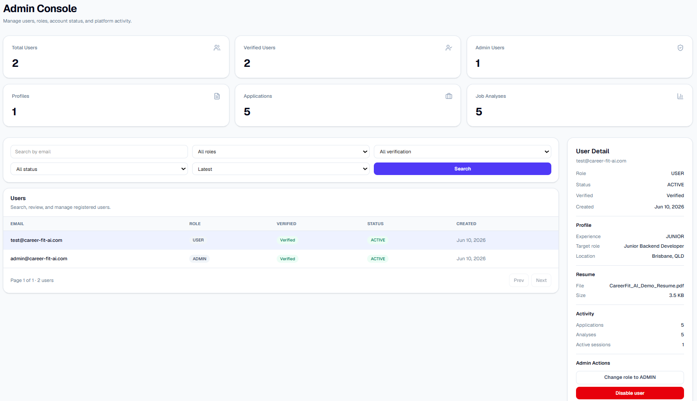
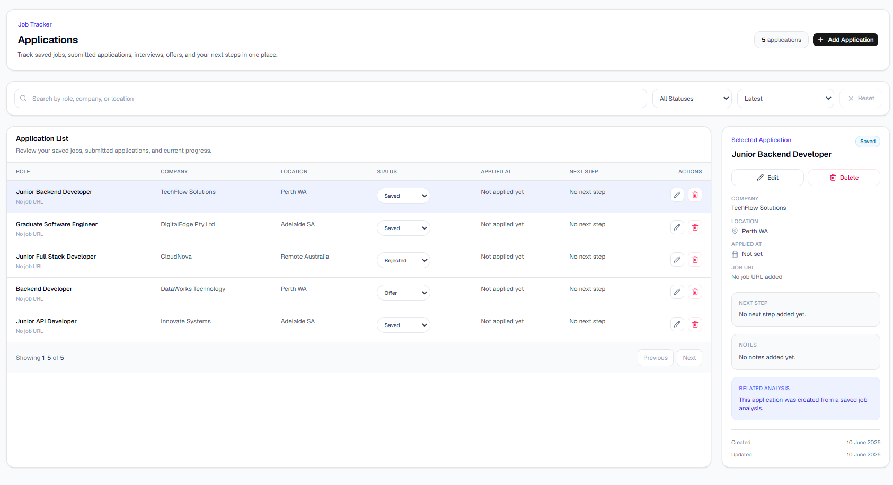
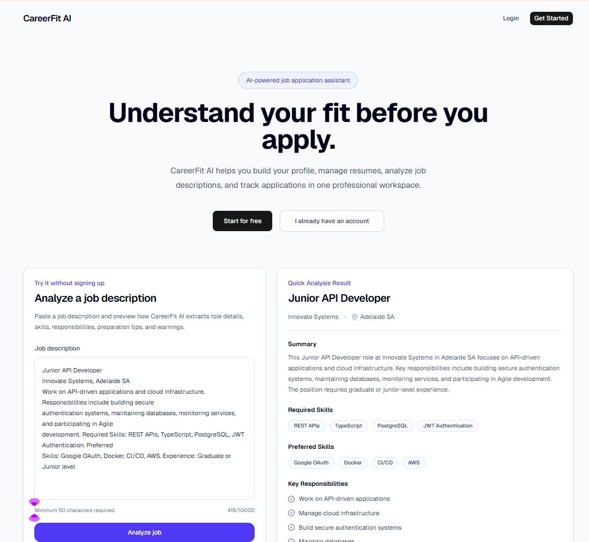
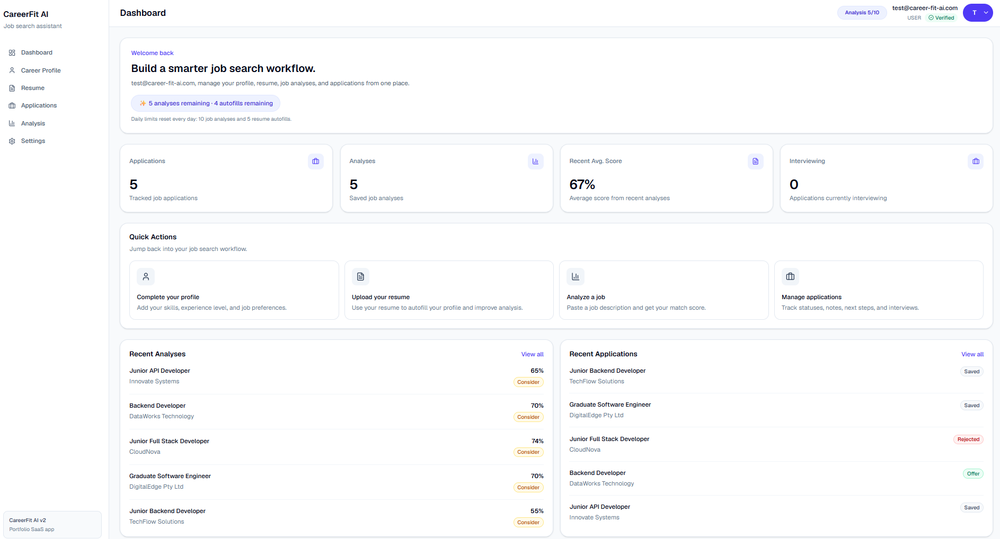
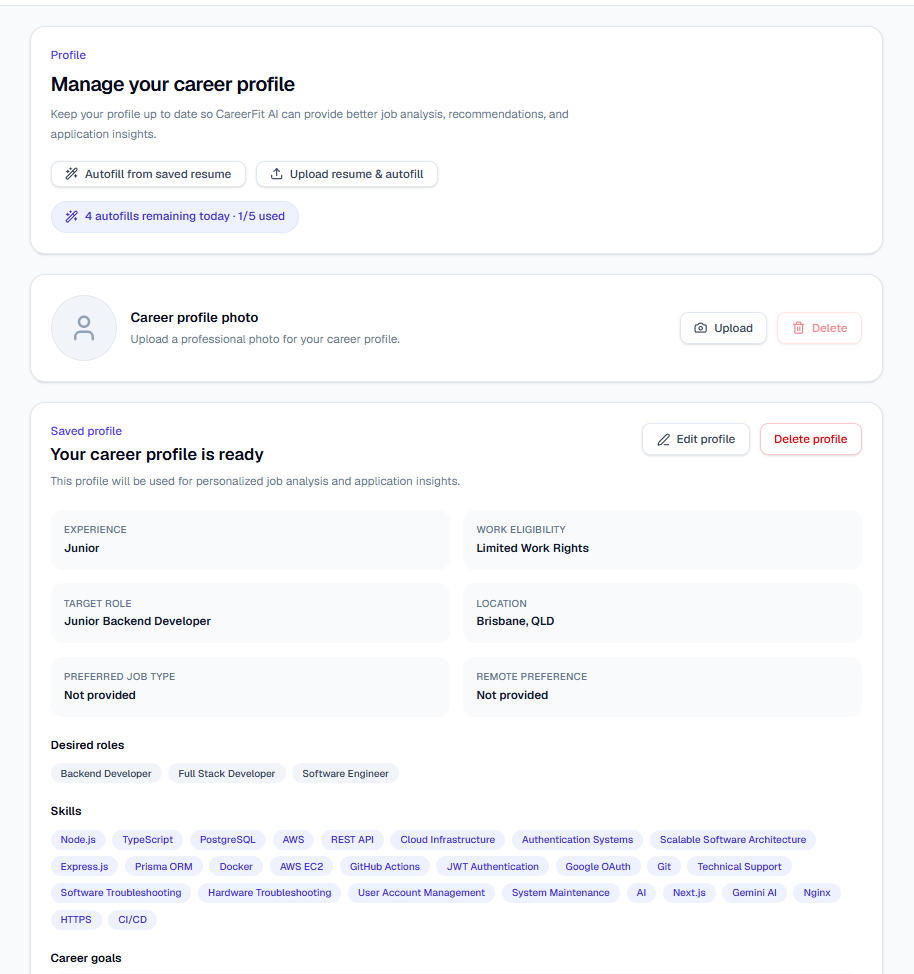
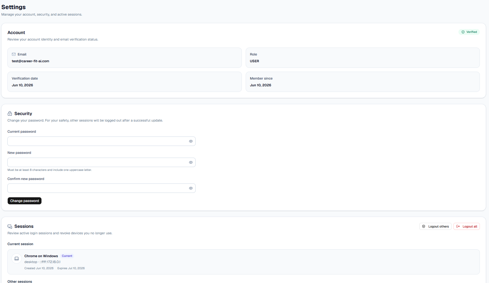
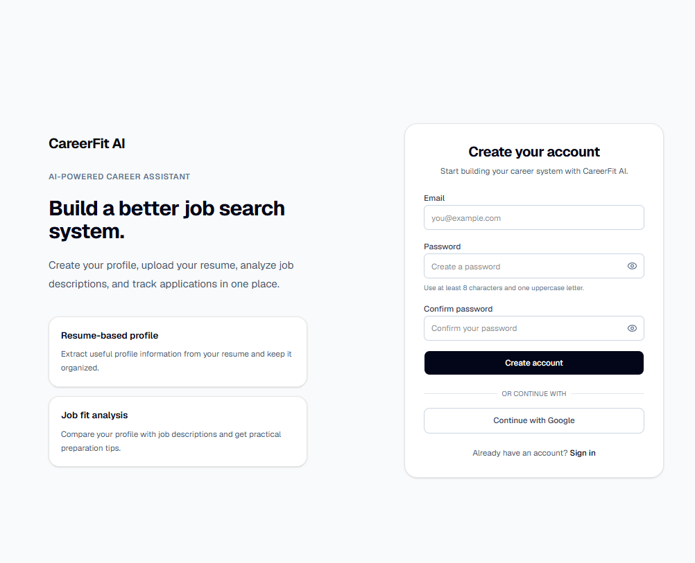

# 🚀 CareerFit AI

AI-Powered Career Management Platform

CareerFit AI is a full-stack SaaS application designed to help job seekers analyze job descriptions, manage resumes, track applications, and gain AI-powered career insights.

Built as a production-ready system, the project includes secure authentication, AI integrations, cloud infrastructure, CI/CD automation, and operational tooling.

---

## 🌐 Live Demo

### Production

https://career-fit-ai.com

---

## 🎯 Demo Account

### Demo User

- Email: test@career-fit-ai.com
- Password: CareerFit123!

> Note:
> Administrative accounts are not publicly accessible.

---

## 📖 Project Overview

Job seekers often need to analyze job descriptions, manage resumes, and track applications across multiple platforms.

CareerFit AI centralizes this workflow into a single application.

Users can:

- Create and manage career profiles
- Upload resumes
- Autofill profiles using AI resume parsing
- Analyze job descriptions using AI
- Track job applications
- Manage account security and sessions
- Sign in with Google OAuth

Administrators can:

- Manage users and roles
- Monitor platform statistics
- Disable user accounts
- Review platform activity

---

## 📸 Screenshots

### 🤖 AI Job Analysis

Analyze job descriptions using Gemini AI and receive detailed insights including fit score, required skills, responsibilities, preparation tips, and career recommendations.

<p align="center">
  
</p>

### 🛠 Admin Dashboard

Monitor platform statistics, manage users, update roles, and review overall platform activity through a centralized admin dashboard.

<p align="center">
  
</p>

### 📋 Application Tracking

Track job applications throughout the hiring process with filtering, searching, sorting, and status management.

<p align="center">
  
</p>

### 🌐 Landing Page

Public landing page featuring AI-powered job analysis, platform highlights, and authentication entry points.

<p align="center">
  
</p>

### 📊 Dashboard

View recent analyses, application statistics, and AI usage information from a single dashboard.

<p align="center">
  
</p>

### 👤 Career Profile

Manage skills, career goals, work eligibility, and employment preferences in a centralized profile.

<p align="center">
  
</p>

### ⚙️ Settings

Manage account security, password updates, active sessions, and account preferences.

<p align="center">
  
</p>

### 🔐 Sign In

Secure authentication with email/password login and Google OAuth integration.

<p align="center">
  
</p>

---

## ✨ Features

### 🔐 Authentication & Security

- User Registration
- Login
- JWT Authentication
- Refresh Token Rotation
- Session Management
- Email Verification
- Forgot Password
- Reset Password
- Change Password
- Logout
- Logout Others
- Logout All
- Google OAuth Login
- Role-Based Authorization

### 👤 Profile Management

- Create Profile
- Update Profile
- Delete Profile
- Avatar Upload
- Skills Management
- Career Goals Management
- Work Preference Management

### 📄 Resume Management

- PDF Upload
- Resume Preview
- Resume Deletion
- PDF Text Extraction
- AI Resume Parsing
- Resume-to-Profile Autofill

### 🤖 AI Features

Powered by Gemini AI

- Job Summary
- Required Skills Analysis
- Preferred Skills Analysis
- Responsibilities Extraction
- Preparation Tips
- Warning Signals
- Fit Score
- Recommendation

### 📋 Application Tracking

- Manual Application Creation
- Create Applications from AI Analysis
- Search, Filter, and Sort
- Status Management
- Soft Delete
- Duplicate Prevention

Supported statuses:

- Saved
- Applied
- Screening
- Interview
- Offer
- Hired
- Rejected
- Withdrawn

### 🛠 Admin Features

- Platform Statistics
- User Management
- User Detail View
- Role Management
- Account Disable / Enable
- Activity Monitoring

---

## 🏗 System Architecture

```text
User
  │
  ▼
Cloudflare
  │
  ▼
Nginx Reverse Proxy
  │
  ├─────────────────────┐
  ▼                     ▼
Frontend            Backend API
(Next.js)           (Express)
                          │
                          ▼
                     PostgreSQL
```

The application is deployed on AWS EC2 using Docker Compose.

Cloudflare provides DNS management and security services.

Nginx acts as a reverse proxy and routes traffic between the frontend and backend services.

The frontend is built with Next.js and communicates with the Express backend through REST APIs.

PostgreSQL is used as the primary database for authentication, profiles, resumes, job analyses, applications, and administrative data.

---

## 🛠 Tech Stack

### Frontend

- Next.js App Router
- TypeScript
- Tailwind CSS
- shadcn/ui
- Axios

### Backend

- Node.js
- Express
- TypeScript
- Prisma ORM

### Database

- PostgreSQL

### Authentication

- JWT
- Refresh Token Rotation
- Google OAuth

### AI

- Gemini API

### Email

- Resend

### Infrastructure

- AWS EC2
- Docker Compose
- Nginx
- Cloudflare
- Let's Encrypt

### CI/CD

- GitHub Actions

### Testing

- Jest
- Supertest

---

## 📚 API Documentation

Interactive API documentation is available through Swagger UI.

The documentation includes:

- Authentication APIs
- Profile APIs
- Resume APIs
- Job Analysis APIs
- Application APIs
- Admin APIs

Swagger provides request/response examples and endpoint details for easier API exploration and testing.

### Development

http://localhost:4000/api-docs

### Production

https://career-fit-ai.com/api-docs

---

## 🚀 Infrastructure & Deployment

Production environment includes:

- AWS EC2
- Docker Compose
- PostgreSQL
- Nginx Reverse Proxy
- HTTPS (Let's Encrypt)
- Cloudflare DNS
- GitHub Actions CI/CD

### Deployment Flow

```text
Developer
    │
    ▼
GitHub Push
    │
    ▼
GitHub Actions
    │
    ▼
SSH into EC2
    │
    ▼
Git Pull
    │
    ▼
Docker Compose Build
    │
    ▼
Container Restart
    │
    ▼
Production Release
```

### Production Features

- Automated deployment via GitHub Actions
- Persistent PostgreSQL data volumes
- Persistent file upload storage volumes
- HTTPS with Let's Encrypt
- Cloudflare DNS and SSL protection
- Nginx reverse proxy routing
- Automated cleanup cron job

---

## 🧪 Testing

Integration testing implemented with Jest and Supertest.

Coverage includes:

- Authentication
- Authorization
- Profile APIs
- Resume APIs
- Application APIs
- Session Management
- Admin APIs

---

## 💡 Challenges & Solutions

### Resume Preview in Production

Problem:

Uploaded PDF resumes were not accessible in production.

Solution:

- Added Nginx static uploads routing
- Implemented Docker persistent volumes

Result:

Resume previews remain available even after container redeployments.

---

### Session Security

Problem:

JWT-only authentication could not support multi-device session management.

Solution:

- Refresh Token Rotation
- Database-backed Session Tracking

Result:

Users can securely manage sessions across multiple devices.

---

### Data Retention

Problem:

Expired tokens and soft-deleted records accumulated over time.

Solution:

- Cleanup Service
- Scheduled Cron Job

Result:

Automated daily cleanup keeps the database healthy and reduces unnecessary storage usage.

---

## 📂 Project Structure

```text
career-fit-ai-v2/
├── backend/
├── frontend/
├── docs/
│   └── screenshots/
├── .github/
├── docker-compose.yml
├── docker-compose.prod.yml
└── README.md
```
## 🔄 Evolution

CareerFit AI started as a backend API project (v1) deployed on Render.

While building and deploying the project, I identified several areas that could be improved, including authentication, deployment, infrastructure, and overall architecture.

CareerFit AI v2 was rebuilt as a full-stack application and introduced:

- Next.js frontend
- Docker-based deployment
- AWS EC2 hosting
- GitHub Actions CI/CD
- Google OAuth
- Session management
- Admin dashboard

## 🔄 Evolution

CareerFit AI started as a backend API project (v1) deployed on Render.

While building and deploying the project, I identified several areas that could be improved, including authentication, deployment, infrastructure, and overall architecture.

CareerFit AI v2 was rebuilt as a full-stack application and introduced:

- Next.js frontend
- Docker-based deployment
- AWS EC2 hosting
- GitHub Actions CI/CD
- Google OAuth
- Session management
- Admin dashboard

---

## 🔮 Future Improvements

### Performance & Scalability

- Redis-based caching
- Background job processing for AI workloads

### AI Features

- AI Resume Review
- AI Resume Improvement Suggestions
- AI-generated Resume PDF Export

### Infrastructure

- Migration from local storage to AWS S3
- Monitoring & Observability Dashboard
- Centralized Logging

### Administration

- Enhanced Admin Analytics Dashboard
- User Activity Reports
- Platform Health Monitoring

---

## 👨‍💻 Author

**Sanghun Han**

Junior Backend Developer

Areas of Interest

- Backend Architecture
- Cloud Infrastructure
- REST API Design
- Authentication Systems
- Scalable Web Services

GitHub: https://github.com/umemarop
